# Minerva — AI-Powered Research Engine

> Internship Project at Aiolos Cloud Solutions, Mumbai
> Team: NextGen Thinker | 2025–2026

---

## What Is Minerva?

Minerva is an AI-powered research engine that takes a natural
language query and returns a structured, citable research report.
It can gather information from the web, process uploaded documents,
and synthesize everything into a single coherent output exportable
in multiple formats.

It was built as a production-grade internal tool during our
internship at Aiolos Cloud Solutions.

---

## The Problem It Solves

Gathering information, reading through multiple sources, and
producing a structured report is time-consuming work. Existing
tools solve pieces of this: search engines find pages but do not
read them, document tools extract text but do not synthesize it,
and AI assistants can summarize but cannot retrieve on their own.

Minerva connects all three steps into a single pipeline. A user
submits a query and receives a complete, structured report in
under a minute.

---

## What It Does

- Searches the web and identifies the most relevant sources
- Reads and extracts content from web pages and PDF documents
- Synthesizes collected content into a structured report using AI
- Streams the report to the screen in real time as it is generated
- Exports the report as PDF, Markdown, or JSON
- Allows follow-up questions on the generated report via
  a built-in chat interface called Ask Minerva

---

## Production Metrics

These numbers were recorded during deployment at Aiolos Cloud
Solutions.

| Metric | Value |
|---|---|
| Total Research Jobs Completed | 168 |
| Success Rate | 88% |
| Average Research Job Duration | 48.59 seconds |
| Total Words Processed | 73,900+ |

---

## Demo

[Watch the full demo video →](./demo/demo_video_link.md)

---

## Screenshots

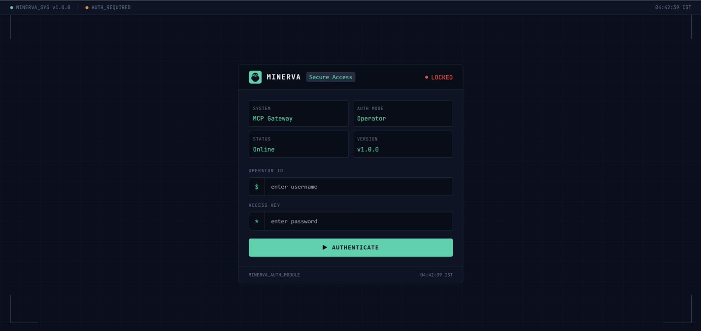

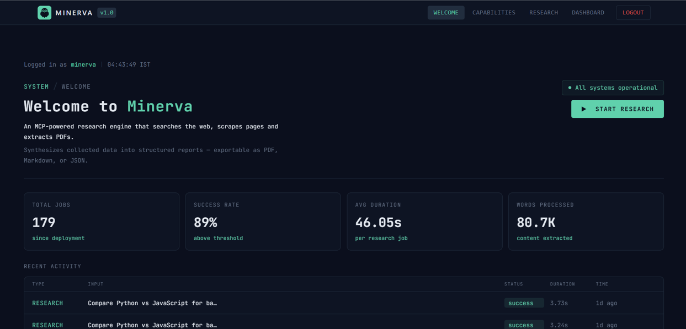

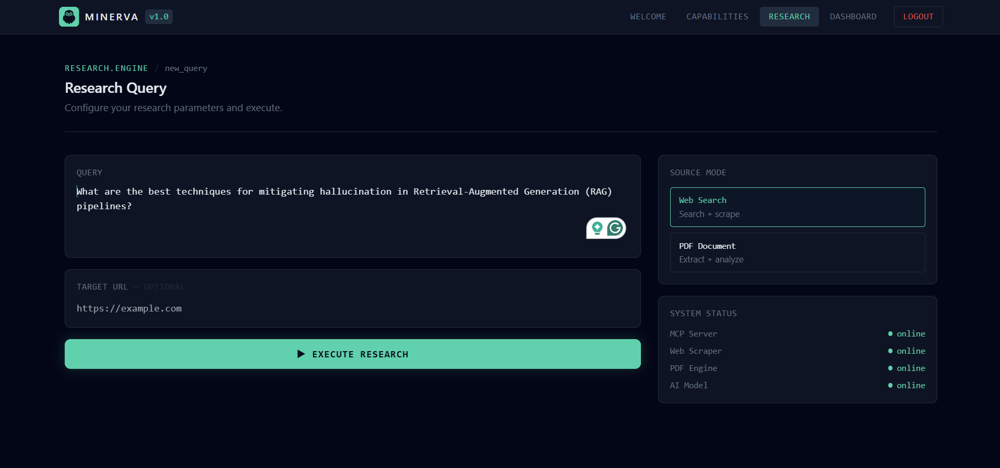

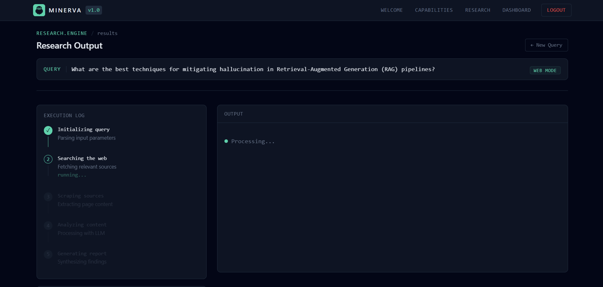

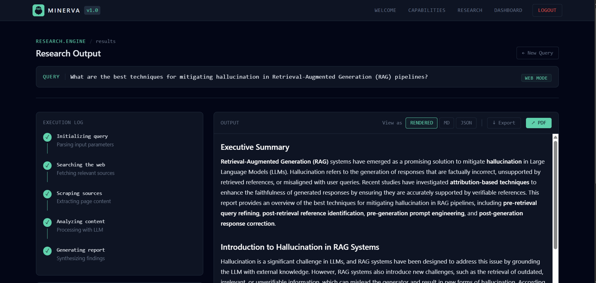

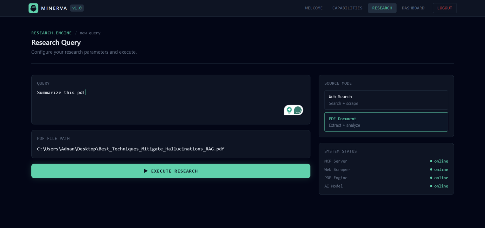

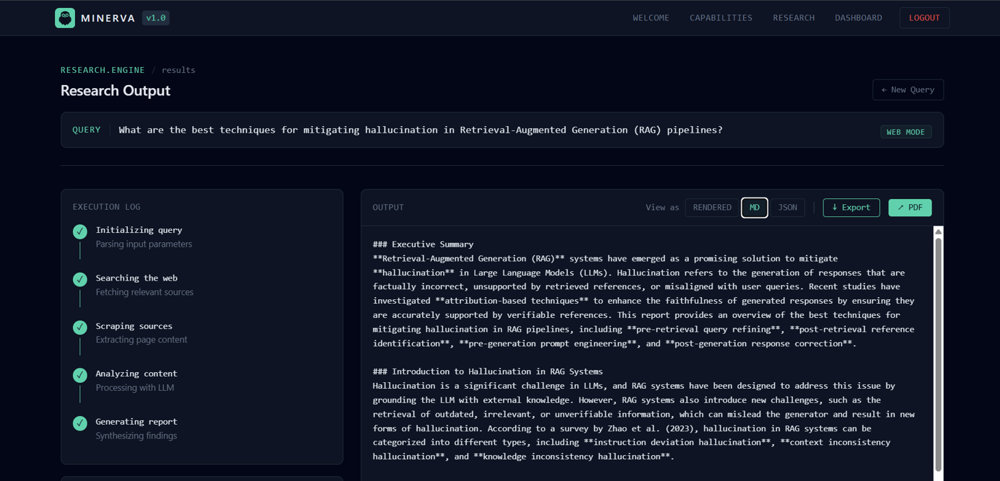

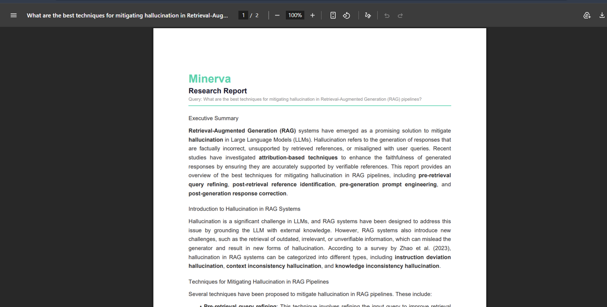

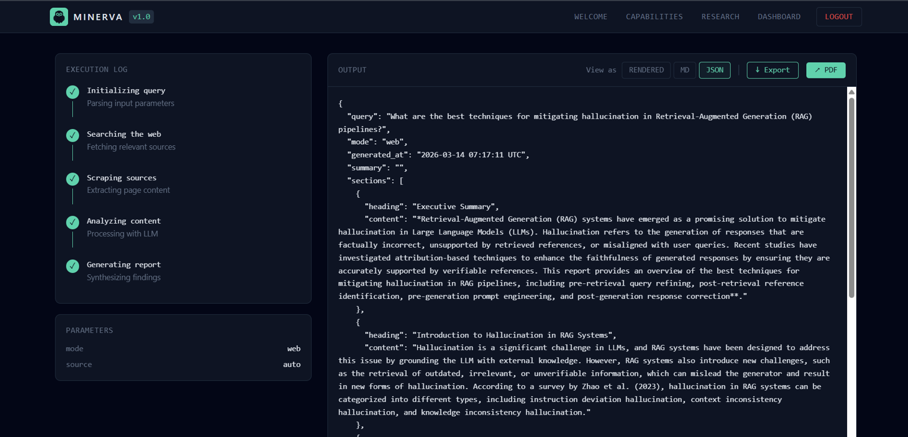

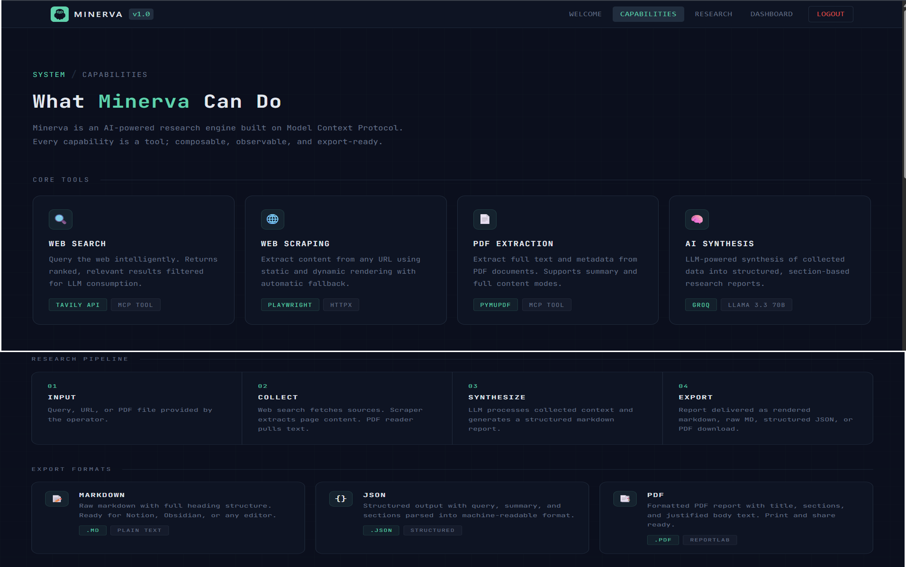

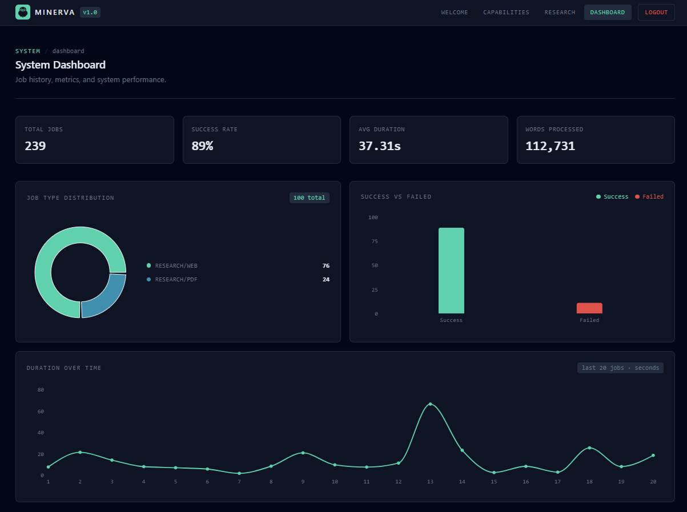

---

## Proof of Work

- Internship completion certificate: [docs/certificate_aiolos.pdf](./docs/certificate_aiolos.pdf)
- Production metrics log: [metrics/production_snapshot.md](./metrics/production_snapshot.md)

---

## Team — NextGen Thinker

Built by four computer engineering students during internship
at Aiolos Cloud Solutions.

| Name | LinkedIn |
|---|---|
| Adnan Bardgujar | [linkedin.com/in/adnan-bardgujar-b43b7a25b](https://www.linkedin.com/in/adnan-bardgujar-b43b7a25b/) |
| Saif Madre | [linkedin.com/in/saif-madre-7986872ba](https://www.linkedin.com/in/saif-madre-7986872ba/) |
| Mohd Salique Khan | [linkedin.com/in/mohdsaliquekhan78622](https://www.linkedin.com/in/mohdsaliquekhan78622/) |
| Fazal Shaikh | [linkedin.com/in/fazal-shaikh-555404195](https://www.linkedin.com/in/fazal-shaikh-555404195/) |

Full team details and individual contributions:
[docs/team.md](./docs/team.md)

---

Built during internship at
[Aiolos Cloud Solutions](https://aiolos.cloud/index)